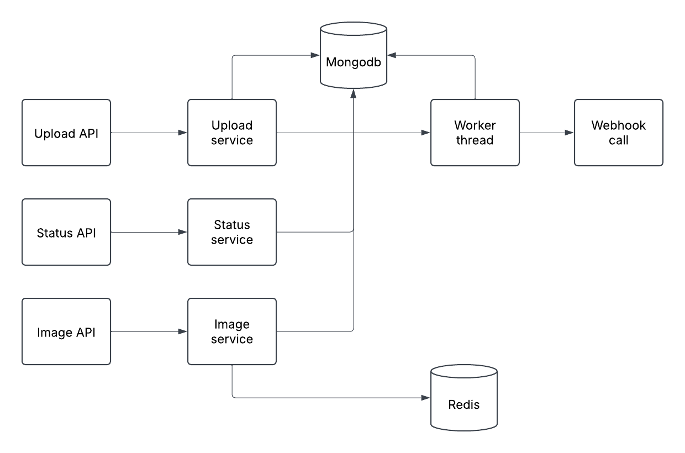

# Low-Level Design (LLD) for CSV-Based Image Processing System

## 1. Overview
This document provides a detailed technical design of a CSV-based image processing system that:
- Accepts a CSV file containing product names and image URLs.
- Validates and processes the images asynchronously.
- Compresses images by 50%.
- Stores processed images in a database (MongoDB).
- Supports APIs for uploading, checking processing status, and retrieving images.
- Supports webhook notifications and outputs a CSV with processed image URLs.

---

## 2. System Architecture
### 2.1 High-Level Flow
1. **CSV Upload API**: Receives and validates the CSV file.
2. **Task Queue**: Adds processing jobs asynchronously.
3. **Worker Threads**: Fetch, validate, and compress images.
4. **Database (MongoDB)**: Stores product details and image metadata.
5. **Redis Cache**: Stores processed images temporarily for fast retrieval.
6. **Webhook System**: Processes callbacks from the image processing service.
7. **APIs**:
   - Upload API to accept CSV files and return a unique request ID.
   - Status API to track processing status.
   - Retrieval API to fetch processed images.
   - CSV Output API to generate a downloadable report.

---

## 3. Component Design

### 3.1 CSV Upload Service
- **Function**: Handles CSV uploads, validates file format, and stores metadata in MongoDB.
- **Validations**:
  - Ensure CSV format correctness.
  - Verify valid image URLs.
- **Technologies**: Express.js, Multer (for file handling).

### 3.2 Job Queue & Worker Threads
- **Function**:
  - Uses worker threads for asynchronous image processing.
  - Fetches images from URLs and compresses them.
  - Stores processed images in MongoDB and Redis.
- **Technologies**: Node.js Worker Threads, BullMQ (Redis-based job queue).

### 3.3 Image Processing Service
- **Function**:
  - Downloads images.
  - Compresses them by 50%.
  - Saves processed images in MongoDB and caches them in Redis.
- **Libraries**: Sharp (for image compression).

### 3.4 Database (MongoDB)
- **Function**:
  - Stores product details, original & processed image URLs, and processing status.
- **Schema**:
  ```json
  {
    "requestId": "string",
    "products": [{
        "serailNumber":"string",
        "productName": "string",
        "images":[{
            "inputUrl":"string",
            "imageId":"string",
            "data":"buffer"
        }]
    }],
    
    "originalImageURL": "string",
    "processedImageURL": "string",
    "status": "pending | processing | completed | failed",
    "createdAt": "timestamp"
  }


## 3.5. Redis Cache
- **Function**:
  - Caches processed images with a TTL for faster access.


## 3.6 API Endpoints

### 3.6.1 Upload API

**Function:** Accepts CSV files and returns a unique request ID.

**Endpoint:**

```
POST /upload
```

### 3.6.2 Status API

**Function:**

- Allows users to check processing status using the request ID.
- Fetches data from MongoDB.

**Endpoint:**

```
GET /status/:requestId
```

### 3.6.3 Image API

**Function:**

- Serves processed images by fetching from Redis or MongoDB.

**Endpoint:**

```
GET /image/:reqId/:imageId
```


## 4. System Diagram




---

## 5. Technology Stack

| Component         | Technology           |
|------------------|---------------------|
| Backend API      | Node.js, Express    |
| Image Processing | Sharp               |
| Database        | MongoDB             |
| Cache          | Redis                |
| API Documentation | Postman           |

---

## 6. Asynchronous Workers Documentation

### **Function:**

- Handles downloading, validating, and compressing images asynchronously.
- Updates the processing status in MongoDB.

### **Worker Flow:**

1. Fetch collection from Mongodb.
2. Download image from URL.
3. Compress image.
4. Store compressed image in MongoDB.
5. Update processing status.
6. Trigger webhook notification.

## 7. Conclusion

This LLD document outlines the system design, components, and technology stack for the CSV-based image processing system. The implementation ensures scalability, reliability, and efficient handling of image processing tasks.
